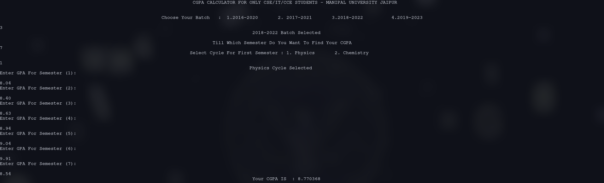

# **CGPA Calculator for CSE/IT/CCE students (Manipal University Jaipur)** ::

- **Only for 2016, 2017, 2018, 2019, and 2020 batches**
- Working on a java,python and a bash build

- Hope this helps you guys. No errors while calculating your CGPA from now on.

> Some problems with the 2019 and 2020 batches as I am not sure about the credits for the 2nd and 3rd years. Working fine, if you want to calculate your CGPA for the first year. I'm not sure about CSE and CCE because they have different credits in the second and third years.

### To calculate your CGPA ::

```
cd CGPA_CALC_MUJ/
./cgpa.out
```

# **Calculator in action** ::



# Contributing ::

**Please check out the [contributing.md](contributing.md) guide on how you can actively participate in the development of cgpa calculator.**


# License 

This project is licensed under the GNU General Public License v3.0 - see the [License.md](https://github.com/radix007/CGPA_CALC_MUJ/blob/master/LICENSE) for more details.
